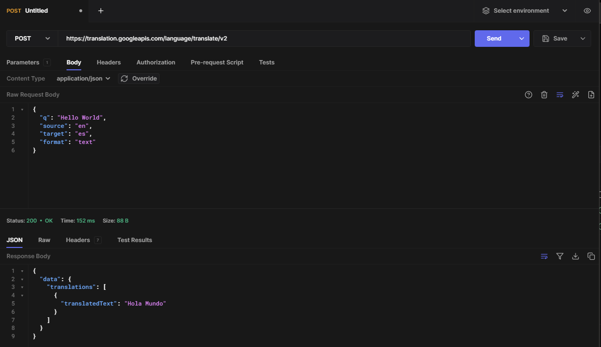

# CSC207 Group Project

## Problem Domain:
Our language translation tool will focus on accessible translation for education and learning with stored translation 
history that can be shared with other users. We will aim to implement multi-language functionality with additional 
methods that can personalize the user experience - whether it be for school, traveling, or personal interest.

## Application:
Our application will perform the following functions: 
1. The user will enter text that they want to translate. 
2. The app will call the google api to translate the inputted text. 
3. Both the translation and the original text is stored. 
4. The user can search for previous translations. 
5. The translations stored are categorized by user as well as by language in the case that the user uses the
application to translate many languages. 
6. There will also be a feature for frequency of searches, potentially flagging common searches so that they are more 
accessible. 
7. There will be a chart/table that shows all the words searched with their translations. If the same word is searched 
for multiple languages it can all show up in the chart (i.e. instead of 2 columns for just the word and the translation,
it will have 3 or more columns, one for the word, and the rest for the translations in each language).

## Documentation link:
https://cloud.google.com/translate/docs/reference/rest/v2/translate

## Screenshot of API

## Example Output for Java Code

## Technical Problems
1. Google’s Cloud Translate API only offers limited features and functionality for free - accessing extra features or 
exceeding certain character limits would be an issue we need to address when designing our software
2. Figuring out how we’re going to access the databases we want to use, the scope of translation that we can implement
using the API
3. Implementing an interface - we have yet to decide how we’re going to display the information and move the data back 
and forth from the database to the user
